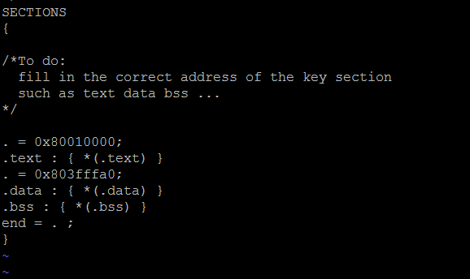

#实验的精髓是折腾
##不折腾状态
###exercise2.1
&emsp;只是简单地设置一下路径，不再赘余
###exercise2.2
&emsp;需要设置内核的位置，那么内核的位置在哪里呢？  
&emsp;mmu.h中规定，内核的起始地址为0x80010000，显然.text段应该放在0x80010000位置。而.data和.bss应该放在哪里呢？这里姑且放在.text后面，后面我们将继续谈到。
###exercise2.3
&emsp;补充汇编语言中的空缺部分。要求“设置栈指针，跳转到主函数”
&emsp;注意，这里的“设置栈指针”和“跳转到主函数”分别是两句话，有的同学好像只设置了栈指针但没有跳转到主函数，所以做到了2.4之后发现还是没有响应的现象出现(郁闷
&emsp;那么栈指针的位置在哪里？同样在mmu.h中规定，内核的栈顶地址为0x80400000，显然应该设置为它。那么我们的主函数在哪里呢？我觉得大家一开始肯定都是一脸懵逼。第一次实验课上就问了下老师，老师大方地给了我提示。这里我们先写出来j main，后面我们同样会继续谈到。
###exercise2.4
&emsp;2.4跟前面三个exercise应该说不是一个级别的。因为它需要我们阅读不少代码。另外这里有不少宏的定义和函数指针之类的之前比较少接触的东西，因此可能理解起来略有难度。我们来分析一下。
####解构lp_Print()函数
&emsp;main.c的main()函数中调用了printf()函数-->printf.c的printf()函数中调用了lp_Print()函数->print.c中对lp_Print()函数进行了定义，那么，定义如何？

	void lp_Print(void (*output)(void *, char *, int),void * arg,char *fmt,va_list ap)  

&emsp;这里的output,arg,fmt,ap都是什么鬼？我们回到printf.c中的printf()函数看一下
  
	void printf(char *fmt, ...)  
	{  
		va_list ap;  
		va_start(ap, fmt);  
		lp_Print(myoutput, 0, fmt, ap);  
		va_end(ap);  
	}

这里的lp_Print()函数中有一个myoutput显然它是传给*output的一个参数？接下来在看myoutput是何方神圣：

	static void myoutput(void *arg, char *s, int l)
	{
	    int i;
	
	    // special termination call
	    if ((l==1) && (s[0] == '\0')) return;
	
	    for (i=0; i< l; i++) {
	        printcharc(s[i]);
	        if (s[i] == '\n') printcharc('\n');
	    }
	}
&emsp;看到这里终于明白了！绕了一大圈，原来myoutput()函数的作用是把已知长度的字符串进行输出。至于具体的printcharc()函数则在console.c中进行了定义，其具体作用应该是在控制台上输出单个字符。  
&emsp;此时还有一个疑惑，就是printf函数中的ap是什么意思？我们可以看到lp_Print()函数中有这样的一段代码，

	case 'd':
    case 'D':
    if (longFlag) {
		num = va_arg(ap, long int);
    } else {
      	num = va_arg(ap, int);
    }
    if (num < 0) {
        num = - num;
        negFlag = 1;
    }
    length = PrintNum(buf, num, 10, negFlag, width, ladjust, padc, 0);
    OUTPUT(arg, buf, length);
    break;
&emsp;由这段代码结合上下文以及对printf()函数的认识，即我们最常使用的

	printf("%d",n);
大致可以看出，printf()函数头部中的\*fmt应该对应我们的"%d"，而参数n有传递到哪里呢？从这段代码中可以知道，当函数通过fmt指针读到字符串中的一个"%"并识别到后面的符号为"d"或"D"时，经通过va\_arg()函数读取到一个数字num，并将该num通过printNum()函数输出到屏幕上，va\_arg()函数在库中通过grep无法找到定义，但是基本可以看出num是该函数在ap中找到的，在printf()函数的定义中，定义了一个va\_list类型的变量ap，并且通过va\_start()通过将ap初始化为我们传递到printf()中的参数。至此，我们对于lp\_Print()函数的定义基本上也就明了了。只需要将传递到lp\_Print()的字符串\*fmt进行逐个遍历，当遇到"%"号时在参数表ap中找到相应参数进行输出就可以了。而且其中大部分代码已经帮我们事先了。至于如何填写实验中代码的空缺，则是一件相对简单的事情。  
&emsp;至此lab1的关键部分基本就结束了。但是前面我们还有没有解答的问题。
##折腾状态
###问题1:.data段和.bss段应该放在哪里？
###问题2:我们应该怎样找到main函数，或者当我们不知道函数的标签时我们应该怎么办？例如在exercise2.2中，如果我们不知道main()函数的标签为main，该怎样找到这个标签呢？
###答案只有一个，那就是调试(折腾)。
###`unassemble`
&emsp;我们先回到第二个问题，假设我们还不知道__main__这个标签，先注释掉，那么从汇编程序start.S来看，我们会跳进一个loop死循环:   

	#include <asm/regdef.h>
	#include <asm/cp0regdef.h>
	#include <asm/asm.h>
                        .section .data.stk
	KERNEL_STACK:
                        .space 0x8000

                        .text
	LEAF(_start)           /*在asm.h中定义的叶子函数，叶子函数不调用其它函数*/   

        .set    mips2      /*.set用于指导汇编器如何工作，控制指令执行顺序*/
        .set    reorder

        /* Disable interrupts */
        mtc0    zero, CP0_STATUS

        /* Disable watch exception. */
        mtc0    zero, CP0_WATCHLO
        mtc0    zero, CP0_WATCHHI

        /* disable kernel mode cache */
        mfc0    t0, CP0_CONFIG
        and     t0, ~0x7
        ori     t0, 0x2
        mtc0    t0, CP0_CONFIG

	/*To do:
	  set up stack
	  you can reference the memory layout in the include/mmu.h
	*/

        lui     sp,0x8040
	#       j       main

	loop:
        j       loop
        nop
	END(_start)            
&emsp;在虚拟机中run起来会发现虚拟机没有输出任何东西，这个时候按ctrl+c，接下来就可以进行调试了。在此我们可以通过输入一个"?"得到gxemul中命令使用的帮助。从帮助中我们可以找到一个反编译的命令`unassemble`，这个命令在指导书中也有提到，我们通过`unassemble 0x80010000`可以得到我们的内核运行的一部分指令。这段mips汇编指令相信大家都能看懂，再按一下回车，继续反编译就可以看到我们熟悉的<main\>标签以及<printf\>标签了，所以我们的问题也就自然而然地解决了。其实这些调试步骤是比较简单地，但是我觉得大部分同学可能一开始都有点懵，所以可能不知道，相信大家get到这个小技能之后肯定能飞起~  
###`dump`
&emsp;接下来我们来看问题2，在实验指导书中已经明确指出了.data段存放已初始化的全局变量未初始化的全局变量和静态变量，.bss段存放着未初始化的全局变量和静态变量。但是在网上查到.bss还包括初始化为0的全局变量和静态变量(后面将进行验证)。并且，程序运行的各个segment的次序应该如下:  
<table>
    <tr>
        <td>栈区</td>
    </tr>
	<tr>
		<td>堆区</td>
	</tr>
    <tr>
        <td>全局/静态区</td>
    </tr>
	<tr>
		<td>常量区</td>
	</tr>    <tr>
        <td>代码区</td>
    </tr>
</table> 
&emsp;内存分配图示@[图片来源](http://blog.sae.sina.com.cn/archives/3202)  
  
&emsp;由于.text段，.data段和.text段的大小在程序编译之前是未知的，因此我们的链接器引入了一个定位计数器，就是下面的小点:
  
	OUTPUT_ARCH(mips)
	/*
	指定输出可执行文件的平台为mips
	*/
	ENTRY(_start)
	/*
	指定输出可执行文件的起始代码段为_start
	*/
	SECTIONS
	{

	/*To do:
  	fill in the correct address of the key section
  	such as text data bss ...
	*/
	
	. = 0x80010000;
	.text : { *(.text) }
	.data : { *(.data) }
	.bss : { *(.bss) }
	end = . ;
	}  

&emsp;我对于定位计数器理解是若设置定位计数器为某代码在内存中的起始地址，链接器将对其中的某一段代码进行计数，计数器随着代码量的大小而递增，当该段代码计数结束时，定位计数器的值恰好为该段代码在内存中的结束地址，则链接器对下一段代码在内存中的起始地址则可以参考该段代码的结束地址，这也许就是链接器名称的由来。为了使我们的内存得到最大的利用，我认为.text段和.data段，.bss段应该连接在一起放置，使得剩余的栈区和堆区的空间最大。  
&emsp;但是我观察到有不少同学竟然将.data段和.bss段放到了栈区以上，也就是上述代码的最后几行为:  

	. = 0x80010000;
	.text : { *(.text) }
	. = 0x80400000;
	.data : { *(.data) }
	.bss : { *(.bss) }
	end = . ;  
&emsp;所以就在自己的虚拟器上试了一下，这样的写法运行起来居然没有问题。考虑到我们的main函数其实相当地简单，所以容错率也是极高。将.data段和.bss段放到0x80400000后面其实是放错了位置的。  
&emsp;内存分配图示@[图片来源](http://blog.sae.sina.com.cn/archives/3202)  
  
&emsp;从图中可知，栈区以上为命令行参数以及环境变量的存储分区，但是我们的程序中并没有涉及到命令行参数。所以放在此处也没有问题。 尝试了一下设置在栈上:  
  
&emsp;在main函数中设置已初始化的数组  
  
&emsp;结果如下  
  
&emsp;而且通过gxemul将内存中的数据dump出来可以发现，栈区的数据跟.data段的数据彼此没有任何交集。
  
&emsp;然后又突然想到，倘若让.data或者.bss段跟栈区又重叠，那么会发生什么情况呢？于是将.data的起始地址设置在栈区中  
    
&emsp;run了一下，在gxemul中把数据dump了出来，结果画面太美不能看。我们的全局变量已经面目全非了。  
  
&emsp;输出也是乱码。  
  
&emsp;最后顺便验证了一下，初始化为0的全局变量不是保存在.data段中而是保存在.bss段中的。因此修改main.c如下:  
  
&emsp;运行dump出内存中的.data段数据:  
  
&emsp;从这段数据可以得知虽然上述的m数组进行了初始化但是并没有被放置在n和a数组之中，所以验证应该是成立的。尽管如此，n数组和a数组中初始化为0的元素却没有被进行"特殊"处理，所以觉得这里还是有一些特殊的机制的。  
以上就是我在本次实验中的一些收获，我觉得本次实验中最重要的还是学会调试。剩下的问题就是对linux命令行和git的学习了。git也是一门大学问，希望有机会跟大家一起探讨。